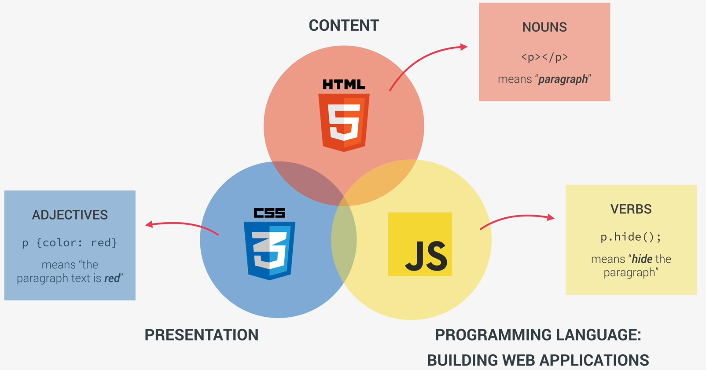

# JavaScript Fundamentals - Part 1

## What is JavaScript?

JavaScript is a high-level, object-oriented, multiparadigm programming language.

All of these stands for:

- high-level: there's no need to worry about memory management, for example. JS has abstraction layers which handle those questions for us.
- object-oriented: it means that the language is based on objects and can store most kinds of data. Also, allows us to work with classes, methods and so on.
- multiparadigm: supports many styles of coding.

## What's the role of JS?

Web development goes like this

- HTML: responsible for the content of the page, e.g., the text, the images, the buttons, all the content we see in a webpage.
- CSS: responsible for the presentation of that content, e.g., styling and laying out the elements in a webpage.
- JavaScript: the real programming language of internet. It allows developers to add dynamic and interactive effects to a webpage. Also it is used to manipulate the content or the CSS, load datafrom remote servers and build entire applications (web applications).

