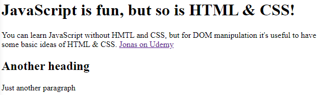

# HTML & CSS Crash Course

## HTML

**HTML** stands for **H**yper**T**ext **M**arkup **L**anguage. It is used to develop content we see within web applications and webpages.

### Elements

Everything is HTML is about elements. A piece of text, an image, a link, a button, an alert message. All of them are elements. And every element is identified by a **tag**. Tags are the way HTML code is structured. For example, a paragraph (showed in a webpage) is represented in HTML by the tag `<p>`. Tags are always initiated with chevrons, like this `<`_tag's name_`>`, and terminated with chevrons and a forward slash, like this `<`_tag's name_`>`.

HTML elements can be divided into _inline elements_ and _block elements_. Next, a block of HTML code containing block elements and inline elements is shown:

> ```html
> <!DOCTYPE html>
> <html lang="en">
>   <head>
>     <meta charset="UTF-8" />
>     <meta http-equiv="X-UA-Compatible" content="IE=edge" />
>     <meta name="viewport" content="width=device-width, initial-scale=1.0" />
>     <title>Learning HTML & CSS</title>
>   </head>
>   <body>
>     <h1>JavaScript is fun, but so is HTML & CSS!</h1>
>     <p>
>       You can learn JavaScript without HMTL and CSS, but for DOM manipulation
>       it's useful to have some basic ideas of HTML & CSS.
>
>       <a href="https://www.udemy.com/user/jonasschmedtmann/"
>         >Jonas on Udemy</a
>       >
>     </p>
>
>     <h2>Another heading</h2>
>     <p>Just another paragraph</p>
>   </body>
> </html>
> ```

And the rendered code:



Here, it is possible to see that elements `<h1>` and `<h2>` are block elements, because they have their own dedicated space in the page. However, the `<a>` element is considered an inline element because it flows inline along with the rest of the text.

### Attributes

Each element in HTML has attributes. That is, built in properties which allows us to add information or modify a certain characteristic of that element.

For example, in the code shown above, it's possible to see a few elements containing attributes, such as in:

> ```html
> <a href="https://www.udemy.com/user/jonasschmedtmann/">Jonas on Udemy</a>
> ```

Another piece of example can be seen here:

> ```html
> <p class="second">Just another paragraph</p>
>
>    id="course-image"
>   src="https://img-c.udemycdn.com/course/480x270/437398_46c3_10.jpg"
> />
>
> <form id="your-name">
>   <h2>Your name here</h2>
>   <p>Please fill in this form :)</p>
>
>   <input type="text" placeholder="Your name" />
>   <button>OK!</button>
> </form>
> ```

In the example above, both elements `` and `<form>` have the attribute _id_ assigned with different values. Those attributes are quite important later on in the development process, mainly while developing CSS style structures or writing JS code.

## CSS

**CSS** stands for **C**ascading **S**tyle **S**heets and is a styling language used to customize the presentation of content written in HTML, for example. Also, it can be used with other markup languages altogether.

Generally, as a good practice while developing web content or applications, it's pretty common to separate content from presentation, which means that CSS structures are written in separate files than HTML ones. Then, just as it happens to JS code, the external file is called from within the **index.html** file.

Here's some basic CSS structure:

```css
body {
  background-color: rgb(241, 214, 123);
  font-family: Arial;
  font-size: 20;
}

h1 {
  font-size: 40px;
}

.first {
  color: red;
}

#your-name {
  background-color: rgb(255, 220, 105);
  border: 5px solid #444;
}
```

Note that within the CSS file there are both HTML elements' tags and attributes. That's because while using CSS to manipulate HTML presentation it is possible to set properties for whole elements and it's children (if the property inherits) or set it only for elements with a specific attribute, such as _class_ or _id_.

### Inheritance

In CSS, some properties will inherit while others won't. Basically, when a property is inherited by the children of a certain element, then all of them have that property set to the very same value. In the example above, within the `body` tag, both _font-family_ and _font-size_ are properties which inherited.

### Box Model


Here's some CSS structure taking box model into account. See:

```css
* {
  margin: 0;
  padding: 0;
  box-sizing: border-box;
}

body {
  background-color: rgb(255, 247, 201);
  font-family: Arial;
  font-size: 20;
  padding: 50px;
}

h1 {
  font-size: 35px;
  margin-bottom: 25px;
}

h2 {
  margin-bottom: 20px;
  text-align: center;
}

p {
  margin-bottom: 20px;
}

.first {
  color: red;
}

#your-name {
  background-color: rgb(255, 220, 105);
  border: 5px solid #444;
  width: 400px;
  padding: 25px;
  margin-top: 20px;
}

input,
button {
  padding: 10px;
  font-size: 16px;
}

#course-image {
  width: 300px;
}

#your-name h2 {
  color: olivedrab;
}
```
